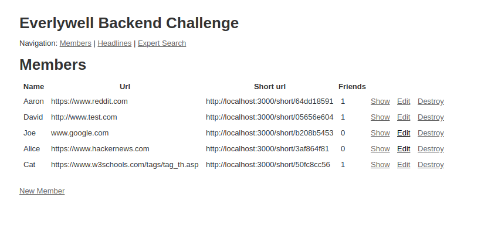
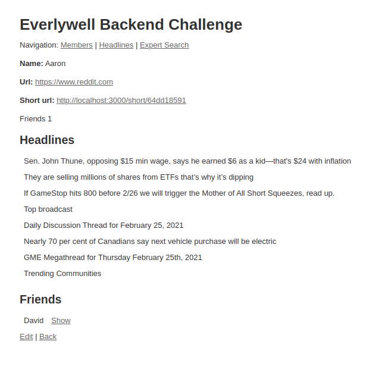
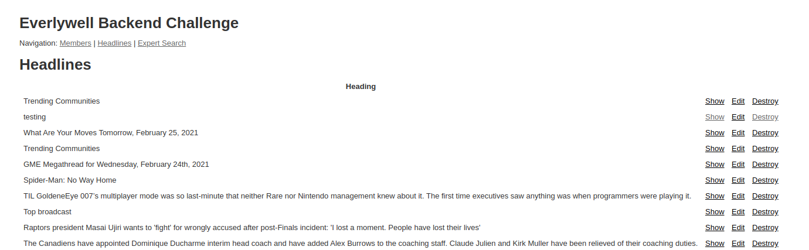
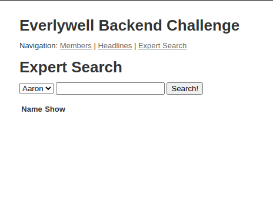

# Everlywell backend Challenge

## Setup

1. Install Ruby v 2.7.1
2. Install [Redis](https://redis.io/topics/quickstart)
3. `cd` in to `everlywell_backend_challenge`
4. > bundle install
5. Install neo4j `rake neo4j:install[community-4.0.6]`
6. Set password `db/neo4j/development/bin/neo4j-admin set-initial-password password`
7. Initialize neo4j server `rake neo4j:start`
8. Start redis server `redis-server`
9. Start sidekiq `bundle exce sidekiq`
10. > rails s
11. Go to [localhost](http://localhost:3000)

## Explanation

This repo houses a basic friend social network, whereby members can become friends and share expertise. 

### Model: Member

A member is a user that creates an account by inserting their name and website. The server then performs two tasks:
1. It crawls the url provided by the user and gathers all `h1`, `h2` and `h3` tags (using nokogiri). This process is handled in a sidekiq worker. The worker can be found in `app/workers/url_header_tag_crawler_worker.rb`. Once the content of the header tags are acquired, they are then stored in the `Headline` dataset.
2. It shortens the URL by generating a `sha1` value from the url. The short url generator can be found in `app/models/member.rb`.

> http://localhost:3000/members

> http://localhost:3000/member/1

### Model: Headline

These are header tags retrieved from member URLs.

> http://localhost:3000/headlines

### Expert Search

This page saerches headlines created by other members.

> http://localhost:3000/expert

### Database: The Graph Database, Neo4j

Initially when thinking about the approach, I debated between the pros and cons of using a relational database (RD) vs a graph database (GD). Note: Non-relational didn't seem like an appropriate option here.

__RD pros:__ I have experience in using it, easier setup, is transactional.
__RD cons:__ Slower performance due to directional nature, changes to a table would require updating prior datasets.

__GD pros:__ It was designed to handle a node/edge system, provide nth connections between nodes.
__GD cons:__ I don't have experience working with it, it is not transactional (from what I have read about Neo4j)

I went with a GD as it was the most appropriate tool for this work.

## Future Improvements

- Add tests. I was unable to get `rspec` working with the `neo4j` server. According to their manual, I needed to set up another server for the test environment and configure a different port number. After creating the new server and setting a new port number, I was left with errors regarding the JDK installation. This would be a major factor of improvement as tests are vital, but as I am unexperienced in Neo4j, I would need to allocate more time in resolving this issue.
- Improve the expert search method
- Improve the UI
- Add indexes in `Member`
- Better error handling
